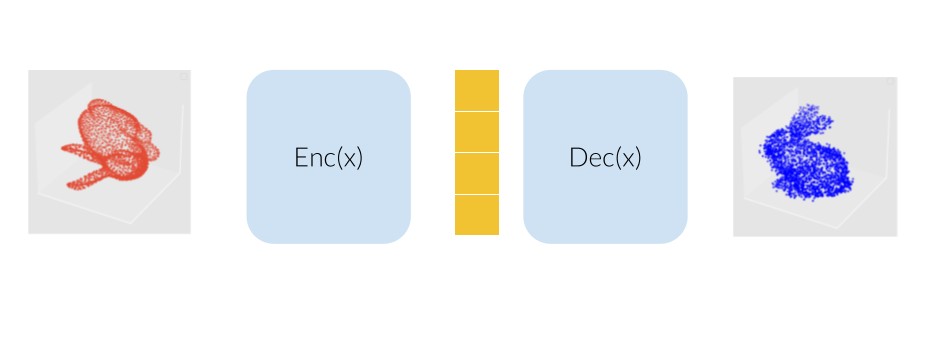
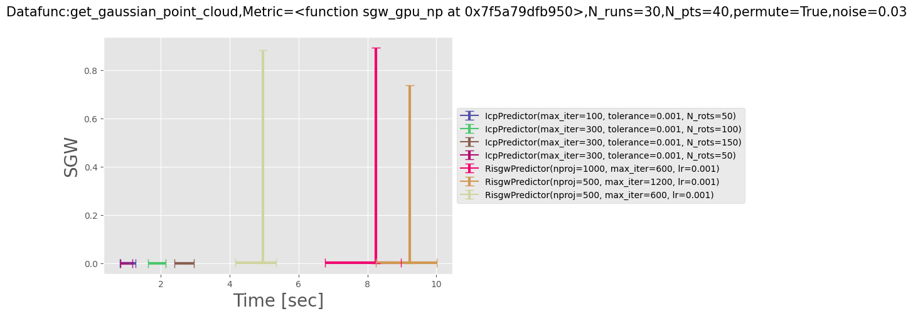
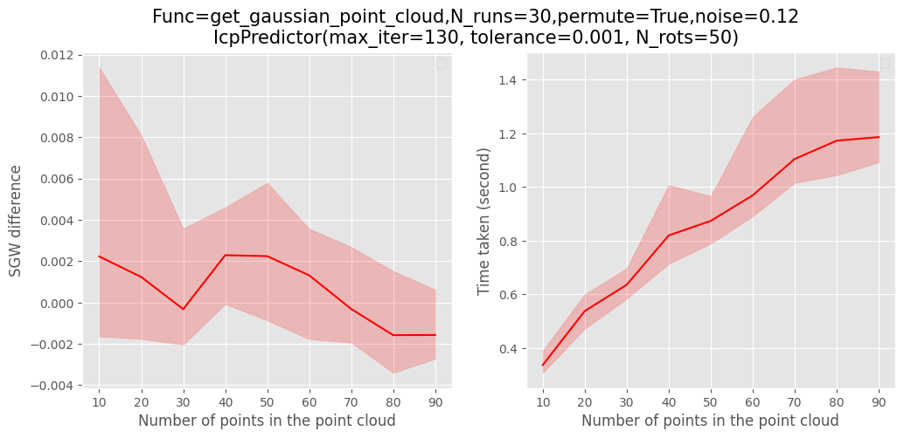
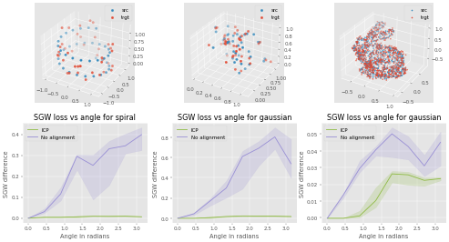
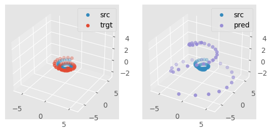

<!-- PROJECT LOGO -->
<br />
  <h1 align="center">Towards an Efficient Loss Function for SE(3) Equivariant Networks-based Molecule Generation</h1>
<p align="center">
   <p align="center">
    An exploration of metrics for equivariant NN based molecule generation
  </p>

  <p align="center" width="100%">
    
  </p>

  <p align="center" style="color:grey;font-size:9px;">Image Copyright: Matt DesLauries, Neural Colors, 2019</p>

  </a>

</p>

## Table of Content

- [About the Project](#about-the-project)
- [Getting Started](#getting-started)
  * [Prerequisites](#prerequisites)
- [Reproducibility](#reproducibility)
  * [Notebooks](#notebooks)
  * [Report Figures](#report-figures)
    + [Point cloud aligner algorithm comparison](#point-cloud-aligner-algorithm-comparison)
    + [ICP scaling](#icp-scaling)
    + [SE(3) Appendix Figures](#se-3--appendix-figures)
- [Project Structure](#project-structure)
- [License](#license)
- [Contact](#contact)


## About the Project
Recent deep learning techniques met a certain success during the past few years in the field of de-novo molecule generation, mainly using graph-based VAEs or recurrent neural network. Molecules are per se objects living in 3 dimensions, modelling them as a set of points in R3 might represent a viable solution for future experiments, as it retains information about relative positions of atoms that graphs and SMILES sequences could fail to grasp. Yet, actual deep learning models dealing with such point clouds face a problem of translation, permutation and rotation invariances, inherant to this type of 3d representation. SE(3) equivariant neural networks could efficiently tackle this issue, as recent experiments tend to show that such architectures not only generalize better and are less data-hungry for analogous task, but also represent a class of universal approximators for the set of equivariant functions.  However, we see that these models require a non-trivial rotation-invariant loss function in order to learn optimally, that we aim at exploring in the present paper.

<br>
<p align="center" width="100%">

</p>
Our model would consist of a VAE using several SE(3) equivariant layers along with one rotation invariant layer, therefore making the model itself becoming invariant to rotation. The molecule are modelled here as a bunny point cloud for sake of simplicity: as we input a non-noisy molecule in the model, the encoder builds a latent vector from which the decoder tries to reconstruct the molecule, up to some error (here modelled as a gaussian noise). We want to find a loss function that penalizes such reconstruction errors, but does not for the part that is due to rotation. More intuitively, we would like a loss function that behaves like the one on the lower right corner of this animation (the lower left shows naive Wasserstein between the input and the output of the model): it increases when the reconstruction error does, but stay overall constant upon rotation of the input point cloud.
<br>
<p align="center" width="100%">

</p>


## Getting Started
### Prerequisites
* `docker`: In order to guarantee results reproducibility, this project runs on docker: after having pulled the latest version of the project, run in the root of the repo:
* alternatively you can use a pyton virtualenv

### Docker
Run:
```
make build_image
```
this will generate the docker image the project runs on: `se3_equiv` (it might take a few minutes).

To determine which host directory the container will write in run:
```
export SE3_RES_DIR=/foo/bar/dir
```
where `/foo/bar/dir` is an absolute path pointing to the directory meant to receive the results.

Once this is done, you can now simply start a container by running:
```
make run_container
```
This will start a bash shell running in the container: from there you'll be able to run several commands to reproduce the figures present in the report. </br>
__NB__
* The port 8888 is forwarded for jupyter notebooks and visualizations purpose
* The `results` directory is mounted as a volume: every modification in this directory will indeed reflect in the host machine. In particular, this is where the figures of the report are generated.

### Python virtual env
If you prefer using a virtualenv, run

```
make create_env
source env/bin/activate
make requirements
```
This should respectively create, activate and install the requirements along with the jupyter kernel necessary to run the commands we will see in the next sections.


## Reproducibility

### Notebooks
```
make start_jupy
```
This command opens a jupyter lab environment running on the container and display it on the host port 8888. The notebooks display several commmented visualizations/ data processing for both loss functions exploration (`3d_pts_alignment.ipynb`) or SE(3) transformer overfit (`se3.ipynb`)

### Report Figures

#### Point cloud aligner algorithm comparison
In order to reproduce the figure `Loss vs time` as follows:

run

```
make loss_vs_time
```
Alternatively, you can modify several parameters like the type of dataset (spiral, gaussian etc) the number of runs per point aligner or the noise amplitude by running:

```
python src/ri_distances/eval_data_param.py --help
```

#### ICP scaling
Similarly, for the ICP scaling figures

run

```
make icp_metrics
```

for help


```
python src/ri_distances/eval_predictor --help
```
#### Rotation invariance 3 datasets
To recreate the figure about invariance to rotations for 3 types of dataset


run
```
make data3
```

#### SE(3) Appendix Figures
Finally, for every figure of SE(3) experiment such as:


run
```
make se3_expes
```
As the training of an SE(3) transformer can be relatively costly even on such small datasets, the program will prompt you to confirm you want to run this experience on a GPU-free device. In this case, the training might take > 30min.


## Project Structure
------------
    .
    ├── Dockerfile
    ├── env # virutalenv
    ├── images # images for the current README.md
    ├── Makefile
    ├── models # checkpoints for ICP and RISGW generated data
    ├── notebooks
    │   ├── 3d_pts_alignment.ipynb # Exploration of the 3d point alignments algorithms
    │   ├── bunny_viz.ipynb
    │   └── se3.ipynb # Chronological exploration of the SE(3) transformer experiments
    ├── README.md
    ├── requirements.txt
    ├── results # directory where the model generates figures
    ├── setup.py # allows to install own code as local python package
    └── src # source code
        ├── paths.py # useful paths
        ├── ri_distances
        │   ├── eval_data_param.py
        │   ├── eval_predictor.py
        │   ├── icp # icp package
        │   ├── metrics.py
        │   ├── pnt_cloud_generation.py
        │   ├── rotation_predictor.py
        │   └── SGW # SGW package
        └── se3
            ├── gpu.py
            ├── se3_expes.py
            ├── torch_funcs.py
            ├── utils.py
            └── visualization.py
--------


## License
Distributed under the MIT License. See `LICENSE` for more information.


## Contact
[Project Link](https://github.com/ymentha14/se3_project)

yann.mentha@gmail.com


